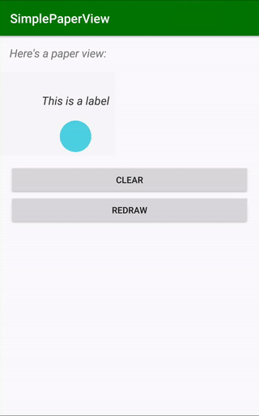

# README #

[  ](https://bintray.com/lukelorusso/maven/com.lukelorusso:simplepaperview/1.1.0/link)

## Presentation ##



This is the source code of an Android library: `-=:[ SimplePaperView ]:=-`  
Simple View to draw lines, circles or text labels

This library is entirely written on Kotlin

minSdkVersion = 21

- - -

## Why would you need it? ##

Have you ever tried to build your own, simple, custom view?  
Saying "it's a pain in the neck" is an euphemism!  

If you just need to draw a graph with some lines, basic shapes and labels all around... it could be very tricky!  

SimplePaperView takes care of anything:  
* draws on canvas
* applies proper translations
* handles onMeasure() method
* gives you the choice to invert the Y axis (like in math)
* considers padding, both programmatically and via layout

All you hate to put you effort on is what you really care: create lines, circles, labels and beautify your view!

- - -

## How you can use it? ##

Add the view to your layout:  
```
<com.lukelorusso.simplepaperview.SimplePaperView
        android:id="@+id/mainSimplePaperView"
        android:layout_width="wrap_content"
        android:layout_height="wrap_content"/>
```  

maybe add some padding or background color:  
```
        ...
        android:background="@color/paperBackground"
        android:paddingTop="5dp"
        android:paddingBottom="5dp"
        android:paddingStart="10dp"
        android:paddingEnd="10dp"
        ...
```  

Let's move to the code!  
If you want to invert Y axis just:  
```
mySimplePaperView.invertY = true
```

to create a lines:  
```
val line = SimplePaperView.Line(
    200F, // starting x position
    200F, // starting y position
    400F, // destination x position
    0F, // destination y position
    Color.GREEN, // the color
    8F // the weight of this line
)
```  

Dimensions may be in pixels or dp: you choose!  

For a circle:  
```
val circle = SimplePaperView.Circle(
    110F, // x position
    100F, // y position
    25F, // radius position
    Color.BLUE, // the color
)
```  

Let's create a text label:  
```
val label = SimplePaperView.TextLabel(
    "your text",
    18F, // text size
    110F, // x position
    50F, // y position
    ContextCompat.getColor(this, R.color.textLabel), // text color
    false, // if you want to center the text horizontally on the x point, set it true! 
    ResourcesCompat.getFont(this, R.font.roboto_italic) // optionally a custom font
)
```  

Now that you have all your items, you can draw one of them:  
```
mySimplePaperView.drawInDp(line)
```  
or  
```
mySimplePaperView.drawInPx(line)
```  

If you need to add multiple items and draw them together at the end, you can:  
```
mySimplePaperView.drawInDp(circle, false) // we invoke the the choice to NOT invalidate the view ("false")
mySimplePaperView.drawInDp(label, true) // now we want to invalidate (redraw) the view ("true")
```  

Anyway, to simplify your life you may want to:  
```
mySimplePaperView.drawInDp( // or in px :)
    listOf(line, circle, label)
)
```  

Do you need a listener when your objects are all drawn?  
```
mainSimplePaperView.setOnDrawListener { Log.d("SimplePaperView", "all drawn!") }
```  

Don't you like your drawing? Just clear the paper:  
```
mySimplePaperView.clearPaper()
```  

Feel free to checkout and launch the example app 🎡

More shapes coming soon! 😎  

- - -

## Real life applications ##

[CalendarTrendView](https://github.com/lukelorusso/CalendarTrendView)  

- - -

## Copyright ##

The App: Copyright 2019 LUCA LORUSSO - http://lukelorusso.com  
